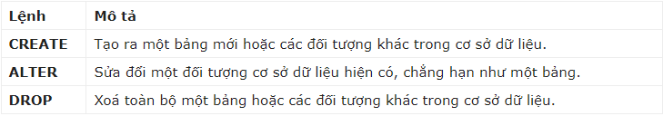
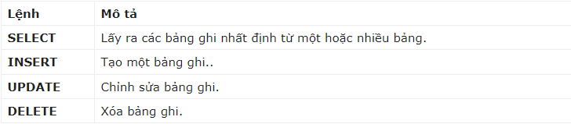
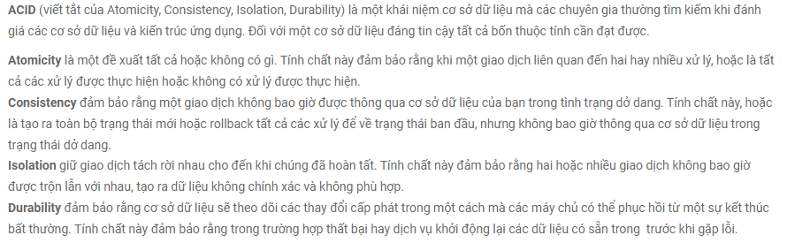

# Cơ sở dữ liệu
## DBMS
- **DBMS** là viết tắt của **Database Management System**, có nghĩa là **Hệ quản trị cơ sở dữ liệu**.
- DBMS là phần mềm được thiết kế để có thể xác định, tiến hành các thao tác, truy xuất và quản lý dữ liệu trong Cơ sở dữ liệu.
- Một vài DBMS phổ biến:
  - MySQL 
  - SQL Server
  - Oracle
  - dBASE
  - FoxPro
## SQL
- **SQL** là viết tắt của **Structured Query Language**, có nghĩa là ngôn ngữ truy vấn có cấu trúc được sử 
dụng để giao tiếp với cơ sở dữ liệu.
- Nó là ngôn ngữ tiêu chuẩn cho các hệ quản trị cơ sở dữ liệu quan hệ.
- Các lệnh SQL tiêu chuẩn để tương tác với cơ sở dữ liệu quan hệ là CREATE, SELECT, INSERT, UPDATE, DELETE và DROP. Các lệnh này có thể được phân thành các nhóm sau dựa trên bản chất của chúng.

*DDL – Ngôn ngữ định nghĩa dữ liệu (Data Definition Language)* bao gồm các lệnh SQL có thể được sử dụng để xác định lược đồ cơ sở dữ liệu.

*DML – Ngôn ngữ thao tác dữ liệu(Data Manipulation Language)* 

*DCL – Ngôn ngữ điều khiển dữ liệu (Data Control Language)* bao gồm các lệnh như GRANT và REVOKE chủ yếu giải quyết các quyền, quyền hạn và các điều khiển khác của hệ thống cơ sở dữ liệu. 

## MySQL
***Khái niệm***
-  MySQL là một hệ thống quản trị cơ sở dữ liệu mã nguồn mở (Relational Database Management System, viết tắt là RDBMS) hoạt động theo mô hình client-server.
-  RDBMS là một phần mềm hay dịch vụ dùng để tạo và quản lý các cơ sở dữ liệu (Database) theo hình thức quản lý các mối liên hệ giữa chúng.

***Ưu điểm***
- Nhanh chóng: Nhờ vào việc đưa ra một số những tiêu chuẩn và cho phép MySQL làm việc hiệu quả cũng như tiết kiệm chi phí, giúp gia tăng tốc độ thực thi.
- Mạnh mẽ và khả năng mở rộng: MySQL hoàn toàn có thể xử lý số lượng lớn dữ liệu và đặc biệt hơn thế nữa thì nó còn có thể mở rộng nếu như cần thiết.
- Đa tính năng: MySQL hiện đang hỗ trợ nhiều những chức năng SQL rất được mong chờ từ 1 hệ quản trị CSDL quan hệ cả gián tiếp cũng như trực tiếp.
- Độ bảo mật cao: Hiện tại nó đang rất thích hợp cho những ứng dụng truy cập CSDL thông qua internet khi sở hữu rất nhiều những tính năng về bảo mật và thậm chí là đang ở cấp cao.
- Dễ dàng sử dụng: MySQL đang là cơ sở dữ liệu dễ sử dụng, ổn định, tốc độ cao và hoạt động trên rất nhiều những hệ điều hành đang cung cấp 1 hệ thống lớn những hàm tiện ích rất mạnh.

***Nhược điểm***
- Dung lượng hạn chế: Trong trường hợp nếu như số lượng bản ghi của bạn đang lớn dần lên thì khi đó quá trình truy xuất dữ liệu sẽ diễn ra vô cùng khó khăn. Như vậy cần phải áp dụng rất nhiều những biện pháp khác nhau để có thể gia tăng được tốc độ truy xuất những dữ liệu ví dụ như tạo cache MySQL hoặc chia tải database ra nhiều server.
- Giới hạn: Theo thiết kế thì MySQL không có ý định thực hiện toàn bộ và nó đang đi kèm cùng với những hạn chế liên quan tới chức năng mà một số ứng dụng có thể cần tới.

## NoSQL DATABASES
### Định nghĩa
- Cơ sở dữ liệu NoSQL là một Hệ thống quản lý dữ liệu không quan hệ (non-relational Data Management System) có lược đồ (schema) linh hoạt.
- Thuật ngữ NoSQL đánh dấu bước phát triển của thế hệ database mới: distributed (phân tán) + non-relational (không ràng buộc). Đây là 2 đặc tính quan trọng nhất.
#### Đặc điểm
- Nó dễ mở rộng. Mục đích chính của việc sử dụng cơ sở dữ liệu NoSQL là dành cho các kho dữ liệu phân tán với nhu cầu lưu trữ dữ liệu lớn. 
- NoSQL được sử dụng cho Dữ liệu lớn (Big Data) và ứng dụng web thời gian thực.

### Đặc điểm chung
- High Scalability: Gần như không có một giới hạn cho dữ liệu và người dùng trên hệ thống.
- High Availability: Do chấp nhận sự trùng lặp trong lưu trữ nên nếu một node (commodity machine) nào đó bị chết cũng không ảnh hưởng tới toàn bộ hệ thống.
- Consistency: chấp nhận tính nhất quán yếu, có thể không thấy ngay được sự thay đổi mặc dù đã cập nhật dữ liệu.
- Durability: dữ liệu có thể tồn tại trong bộ nhớ máy tính nhưng đồng thời cũng được lưu trữ lại đĩa cứng.
- Deployment Flexibility: việc bổ sung thêm/loại bỏ các node, hệ thống sẽ tự động nhận biết để lưu trữ mà không cần phải can thiệp bằng tay. Hệ thống cũng không đòi hỏi cấu hình phần cứng mạnh, đồng nhất.

### Phân loại 

#### Key - Value
***Khái niệm***
   - Dữ liệu được lưu trữ trong các cặp khóa / giá trị (Key/Value Pair).
   - Nó được thiết kế theo cách để xử lý nhiều dữ liệu và tải nặng.
   
   - Một vài cơ sở dữ liệu key-value phổ biến là Riak, Redis(thường dùng phía server), memcached, Berkeley DB, HamsterDB, Amazon DynamoDB(mã nguồn đóng), Project Voldemort và Couchbase.

***Nhược điểm*** 
- Không có mối quan hệ giữa Multiple-Data.
- Operation by groups: Vì các hoạt động được giới hạn trong một khóa tại một thời điểm, không có cách nào để chạy nhiều khóa đồng thời.
- Query Data by ‘value’: Tìm kiếm ‘khóa’ dựa trên một số thông tin được tìm thấy trong phần ‘giá trị’ của các cặp khóa-giá trị.

#### Column-based
***Khái niệm***
- Với Column based database, dữ liệu được lưu trữ trong database dưới dạng các cột. Mỗi cột được xử lý riêng biệt. Giá trị của cơ sở dữ liệu cột đơn được lưu trữ liền kề.
- Mang lại hiệu suất cao cho các truy vấn tổng hợp như SUM, COUNT, AVG, MIN, v.v. vì dữ liệu có sẵn trong một cột.
- Cơ sở dữ liệu NoSQL dựa trên cột được sử dụng rộng rãi để quản lý data warehouses, business intelligence, CRM, Library card catalogs…
- Một vài cơ sở dữ liệu Column-based phổ biến là Hbase, Cassandra, Hypertable.

***Nhược điểm***
- Load dữ liệu theo kiểu incremental(sao lưu gia tăng): Cần nhiều thời gian cho tác vụ ghi hơn tác vụ đọc.

#### Document-Oriented
***Khái niệm***
- Tài liệu là nguyên lý chính của cơ sở dữ liệu kiểu dữ liệu. Dữ liệu lưu trữ và lấy ra là các tài liệu với định dạng XML, JSON, BSON,…
- Có thể nói cơ sở dữ liệu tài liệu là 1 phần của key-value.
- Loại document này chủ yếu được sử dụng cho các hệ thống CMS, nền tảng blog, phân tích thời gian thực và các ứng dụng thương mại điện tử.
- Một vài cơ sở dữ liệu Document-Oriented là MongoDB, Riak, Amazon SimpleDB, Lotus Notes

***Nhược điểm***
- Thông tin cơ sở trùng lặp trên nhiều tài liệu.
- Thiết kế phức tạp dẫn đến không nhất quán.

#### Graph-Based
***Khái niệm*** 
- Cơ sở dữ liệu kiểu đồ thị (Graph Based) lưu trữ các thực thể cũng như các mối quan hệ giữa các thực thể đó. 
- Thực thể được lưu trữ dưới dạng một node với mối quan hệ là các cạnh. Một cạnh cho biết mối quan hệ giữa các node. Mỗi node và cạnh có một mã định danh duy nhất.
- Cơ sở dữ liệu Đồ thị có bản chất là đa quan hệ. Mối quan hệ truyền tải nhanh chóng vì chúng đã được ghi lại vào DB và không cần phải tính toán chúng.
- Cơ sở dữ liệu đồ thị chủ yếu được sử dụng cho mạng xã hội, hậu cần, dữ liệu không gian.
- Một vài cơ sở dữ liiệu Graph-Based là OrientDB, FlockDB, Neo4J 

***Nhược điểm***
- Trong nhiều trường hợp, graph database cung cấp các kiểu đọc và kiểu ghi đơn, điều này cản trở sự đồng thời và hiệu suất.
- Thiếu ngôn ngữ chuẩn: Việc thiếu sự thiết lập và một ngôn ngữ khai báo chuẩn là một vấn của NoSQL graph database.
- Thiếu tính song song (parallelism): việc phân vùng một biểu đồ là một vấn đề. Hầu hết các graph database không cung cấp các truy vấn song song trên các biểu đồ lớn.

### Những hạn chế của NoSQL databases
***No Schema***
- Ngay cả khi bạn lấy dữ liệu ở dạng tự do, bạn hầu như luôn cần áp đặt các ràng buộc để làm cho nó hữu ích. Với NoSQL, trách nhiệm sẽ được chuyển từ cơ sở dữ liệu sang nhà phát triển, lập trình ứng dụng.

***Sự nhất quán***
- CSDL NoSQL đánh đổi tính nhất quán mạnh mẽ hoặc tức thì để có tính khả dụng và hiệu suất tốt hơn. 

***Sự phụ thuộc***
- Hầu hết các hệ thống CSDL NoSQL đều giống nhau về mặt khái niệm, nhưng được triển khai rất khác nhau. Mỗi loại có xu hướng có các cơ chế riêng về cách quản lý và truy vấn dữ liệu.

***Quản lý dữ liệu***
- Mục đích của các công cụ dữ liệu lớn là làm cho việc quản lý một lượng lớn dữ liệu trở nên đơn giản nhất. Nhưng quản lý dữ liệu trong NoSQL phức tạp hơn nhiều so với cơ sở dữ liệu quan hệ.

### Định lý CAP (CAP Theorem)
- Định lý CAP hoặc định lý Eric Brewers nói rằng chúng ta chỉ có thể đạt được nhiều nhất hai trong ba điều kiện đảm bảo cho một cơ sở dữ liệu: Tính nhất quán, Tính khả dụng và Dung sai phân vùng (Consistency, Availability and Partition Tolerance – CAP):
  - Tính nhất quán: Mọi lần đọc đều nhận được lần ghi gần đây nhất hoặc lỗi.
  - Tính khả dụng: Mọi yêu cầu đều nhận được phản hồi (không lỗi) – mà không cần đảm bảo rằng nó có chứa lần viết gần đây nhất.
  - Dung sai phân vùng: Ngay cả khi có sự cố mất mạng trong trung tâm dữ liệu và một số máy tính không thể truy cập được, hệ thống vẫn tiếp tục hoạt động.
- Không có hệ thống nào có thể đảm bảo nhiều hơn 2 thuộc tính. Trong trường hợp của một hệ thống phân tán, việc phân vùng mạng là điều bắt buộc, vì vậy sự cân bằng luôn là giữa tính nhất quán và tính khả dụng.

## So sánh SQL và NoSQL

| Tham số                   | SQL                                                                                                                                                     | NoSQL                                                                                                                                                                                     |
|---------------------------|---------------------------------------------------------------------------------------------------------------------------------------------------------|-------------------------------------------------------------------------------------------------------------------------------------------------------------------------------------------|
| Định nghĩa                | Cơ sở dữ liệu SQL chủ yếu được gọi là RDBMS hoặc Cơ sở dữ liệu quan hệ                                                                                  | Cơ sở dữ liệu NoSQL chủ yếu được gọi là cơ sở dữ liệu không liên quan hoặc csdl phân tán                                                                                                  |
| Design for                | RDBMS truyền thống sử dụng cú pháp và truy vấn SQL để phân tích và lấy dữ liệu để có thêm thông tin chi tiết. Chúng được sử dụng cho các hệ thống OLAP. | Hệ thống cơ sở dữ liệu NoSQL bao gồm nhiều công nghệ cơ sở dữ liệu khác nhau. Các cơ sở dữ liệu này được phát triển để đáp ứng nhu cầu trình bày cho sự phát triển của ứng dụng hiện đại. |
| Ngôn ngữ Query            | Structured query language (SQL)                                                                                                                         | Không có ngôn ngữ query                                                                                                                                                                   |
| Type                      | SQL databases là cơ sở dữ liệu dựa trên bảng.                                                                                                           | NoSQL databases có thể dựa trên tài liệu, cặp khóa-giá trị, cơ sở dữ liệu biểu đồ.                                                                                                        |
| Schema                    | SQL databases có lược đồ được xác định trước.                                                                                                           | NoSQL databases sử dụng lược đồ động cho dữ liệu phi cấu trúc.                                                                                                                            |
| Khả năng mở rộng          | SQL databases có thể mở rộng theo chiều dọc.                                                                                                            | NoSQL databases có thể mở rộng theo chiều ngang.                                                                                                                                          |
| Ví dụ                     | Oracle, Postgres, and MS-SQL.                                                                                                                           | MongoDB, Redis, , Neo4j, Cassandra, Hbase.                                                                                                                                                |
| Phù hợp cho               | Đây là 1 lựa chọn lý tưởng cho môi trường truy vấn phức tạp.                                                                                            | Không phù hợp với truy vấn phức tạp.                                                                                                                                                      |
| Lưu trữ dữ liệu phân cấp  | SQL databases không thích hợp cho việc lưu trữ dữ liệu phân cấp.                                                                                        | Phù hợp hơn cho kho lưu trữ dữ liệu phân cấp vì nó hỗ trợ phương thức cặp khóa-giá trị.                                                                                                   |
| Variations                | Một loại có biến thể nhỏ.                                                                                                                               | Nhiều loại khác nhau bao gồm các kho khóa-giá trị, cơ sở dữ liệu tài liệu và cơ sở dữ liệu đồ thị.                                                                                        |
| Năm phát triển            | Nó được phát triển vào những năm 1970 để giải quyết các vấn đề với lưu trữ tệp phẳng.                                                                   | Được phát triển vào cuối những năm 2000 để khắc phục các vấn đề và hạn chế của SQL databases.                                                                                             |
| Open-source               | Một sự kết hợp của mã nguồn mở như Postgres &amp; MySQL, và thương mại như Oracle Database.                                                             | Open-source                                                                                                                                                                               |
| Tính nhất quán            | Nó phải được cấu hình cho sự nhất quán chặt chẽ.                                                                                                        | Nó phụ thuộc vào DBMS như một số cung cấp tính nhất quán mạnh mẽ như MongoDB, trong khi những người khác cung cấp chỉ cung cấp sự nhất quán cuối cùng, như Cassandra.                     |
| Được sử dụng tốt nhất cho | RDBMS database là tùy chọn thích hợp để giải quyết các vấn đề về ACID.                                                                                  | NoSQL được sử dụng tốt nhất để giải quyết các vấn đề về tính khả dụng của dữ liệu                                                                                                         |
| Tầm quan trọng            | Nó nên được sử dụng khi hiệu lực dữ liệu là siêu quan trọng                                                                                             | Sử dụng khi nó quan trọng hơn để có dữ liệu nhanh hơn dữ liệu chính xác                                                                                                                   |
| Lựa chọn tốt nhất         | Khi bạn cần hỗ trợ truy vấn động                                                                                                                        | Sử dụng khi bạn cần mở rộng quy mô dựa trên yêu cầu thay đổi                                                                                                                              |
| Hardware                  | Specialized DB hardware (Oracle Exadata, etc.)                                                                                                          | Commodity hardware                                                                                                                                                                        |
| Network                   | Highly available network (Infiniband, Fabric Path, etc.)                                                                                                | Commodity network (Ethernet, etc.)                                                                                                                                                        |
| Loại lưu trữ              | Highly Available Storage (SAN, RAID, etc.)                                                                                                              | Commodity drives storage (standard HDDs, JBOD)                                                                                                                                            |
| Tính năng tốt nhất        | Hỗ trợ đa nền tảng, Bảo mật và miễn phí                                                                                                                 | Dễ sử dụng, hiệu suất cao và công cụ linh hoạt.                                                                                                                                           |
| Mô hình ACID và BASE      | ACID (Atomicity, nhất quán, cách ly và độ bền) là một chuẩn cho RDBMS                                                                                   | Cơ bản (Về cơ bản có sẵn, trạng thái mềm, phù hợp cuối cùng) là một mô hình của nhiều hệ thống NoSQL                                                                                      |
| Performance               | SQL hoạt động tốt và nhanh thì việc desgin tốt là cực kì quan trọng và ngược lại.                                                                       | Nhanh hơn SQL. NoSQL thì cho phép bạn lấy được tất cả thông tin về một item cụ thể với các codition mà không cần JOIN liên quan hoặc truy vấn SQL phức tạp.                               |
| Kết luận                  | Dự án đã có yêu cầu dữ liệu rõ ràng xác định quan hệ logic có thể được xác định trước.                                                                  | Phù hợp với những dự án yêu cầu dữ liệu không liên quan, khó xác định, đơn giản mềm dẻo khi đang phát triển.                                                                              |

## NewSQL
### Giới thiệu
 - NewSQL là loại CSDL dựa trên các nguyên lý CSDL quan hệ và cung cấp khả năng mở rộng như NoSQL.
 - Nó kết hợp độ tin cậy của SQL với tốc độ và hiệu suất của NoSQL.
 - NewSQL là một hệ thống cơ sở dữ liệu duy nhất kết hợp việc tuân thủ [ACID](https://phoenixnap.com/kb/acid-vs-base)(Tính nguyên tử, nhất quán, cô lập và bền vững) với việc mở rộng quy mô theo chiều ngang . 

 
- Phân vùng: 
  - Hầu hết tất cả các hệ thống quản lý cơ sở dữ liệu NewSQL đều mở rộng quy mô bằng cách chia cơ sở dữ liệu thành các tập con riêng biệt được gọi là 
  phân vùng hoặc phân đoạn. 
  - Các bảng được chia theo chiều ngang thành nhiều đoạn có ranh giới dựa trên giá trị cột.
  - Các đoạn liên quan từ các bảng khác nhau được nối để tạo phân vùng.
  
  

- Nhân bản: 
  - Cho phép người dùng CSDL tạo và duy trì các bản sao của CSDL hoặc 1 phần của CSDL.
  - Người dùng có thể cập nhật các bản sao đồng thời hoặc cập nhật 1 nút và chuyển trạng thái kết quả sang các bản sao khác.
- Chỉ mục thứ cấp:
  - Cho phép người dùng CSDL truy cập hiệu quả vào các bản ghi CSDL bằng cách sử dụng 1 giá trị khác với khóa chính.
  
- Kiểm soát đồng thời: 
  - Giải quyết các sự cố có thể xảy ra trong hệ thống nhiều người dùng trong khi nhiều người dùng truy cập hoặc sửa đổi dữ liệu đồng thời.
- Phục hồi sự cố: 
  - NewSQL databases có cơ chế cho phép chúng khôi phục dữ liệu và chuyển sang trạng thái nhất quán khi hệ thống gặp sự cố.
### Tính năng 
- Lưu trữ trong bộ nhớ và xử lý dữ liệu cung cấp kết quả truy vấn nhanh chóng.
- Phân vùng chia tỷ lệ cơ sở dữ liệu thành các đơn vị. Các truy vấn thực thi trên nhiều phân đoạn và kết hợp thành một kết quả duy nhất.
- Thuộc tính ACID bảo toàn các tính năng của RDBMS.
- Lập chỉ mục thứ cấp dẫn đến việc xử lý truy vấn và truy xuất thông tin nhanh hơn.
- Tính khả dụng cao do cơ chế nhân bản cơ sở dữ liệu.
- Cơ chế khôi phục sự cố tích hợp mang lại khả năng chịu lỗi và giảm thiểu thời gian chết.

### Khác nhau giữa SQL - NoSQL - NewSQL

| Feature           | SQL                    | NoSQL                   | NewSQL                      |
|-------------------|------------------------|-------------------------|-----------------------------|
| Schema            | Relational (table)     | Schema-free             | Both                        |
| SQL               | Yes                    | Depends on the system   | Yes, with enhanced features |
| ACID              | Yes                    | No (BASE)               | Yes                         |
| OLTP              | Partial support        | Not supported           | Full support                |
| Scaling           | Vertical               | Horizontal              | Horizontal                  |
| Distributed       | No                     | Yes                     | Yes                         |
| High availability | Custom                 | Auto                    | Built-in                    |
| Queries           | Low complexity queries | High complexity queries | Both                        |

### Một số NewSQL database
#### Clustrix DB
- Là 1 hệ thống tự quản lý tự thực hiện tất cả các hoạt động phức tạp và thêm các máy chủ để tăng dung lượng, 
công suất và loại bỏ nguy cơ chậm trễ thời gian do lỗi phần cứng. 

 
 
#### NuoDB 
- Là 1 CSDL phân tán theo địa lý với khả năng mở rộng linh hoạt. Cơ sở dữ liệu ánh xạ dữ liệu qua các điểm khác nhau trong khi vẫn tuân thủ ACID.

#### CockroachDB
- CSQL cung cấp tính nhất quán dữ liệu mạnh mẽ và hoạt động tốt với các tài nguyên có độ trễ thấp.

